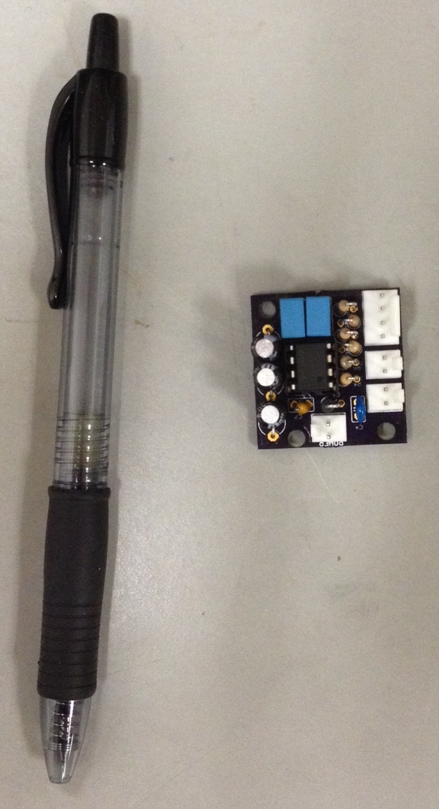

## Description

This is a low-cost op-amp boost pedal meant for use with guitar. The form factor is intended to be very small. Included you will find the eagle files for the board, wiring diagrams, finished photos, pspice simulation files, and a bill of materials to estimate the total cost. PSpice simulations are also included.

### Current revision of the populated PCB:

### Finished Pedal:

